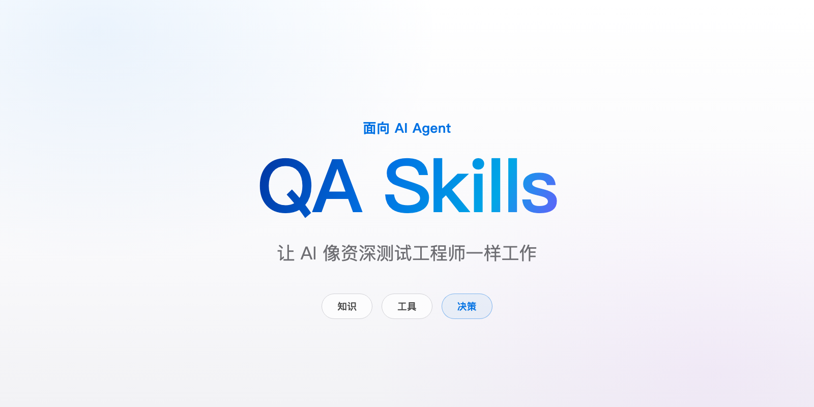

**English** | [简体中文](./README.md)

<p align="center">
  <picture>
    <source media="(prefers-color-scheme: dark)" srcset="./assets/hero-dark.png">
    
  </picture>
</p>

<h1 align="center">qa-skills</h1>

<p align="center"><strong>Make AI work like a senior QA engineer.</strong></p>

<p align="center">Knowledge × tools × decisions — a QA engineering skill framework for Claude Code and other AI agents.<br>Every number comes from measurement.</p>

<p align="center">
  <a href="https://github.com/fishzjp/qa-skills/actions/workflows/ci.yml"></a>
  <a href="./skills/"></a>
  <a href="https://github.com/fishzjp/qa-skills/releases"></a>
  <a href="https://github.com/fishzjp/qa-skills/blob/main/LICENSE"></a>
</p>

---

## Quick start

### Install

**Option 1: the universal install script** (auto-detects agent skills directories)

```bash
git clone https://github.com/fishzjp/qa-skills.git
cd qa-skills

./install.sh        # interactive: auto-detects agent skills directories (~/.agents/skills, ...)
./install.sh --auto # or fully automatic
```

**Option 2: [skills.sh](https://skills.sh) cross-agent install** (Claude Code / Cursor / Codex / OpenCode and 50+ other hosts)

```bash
npx skills add fishzjp/qa-skills            # interactive selection; install everything with --skill '*'
```

**Option 3: the DeepSeek Harness (dsh) plugin** ([`dsh-qa-skills` on npm](https://www.npmjs.com/package/dsh-qa-skills))

```bash
dsh plugin --profile web add dsh-qa-skills
```

> `core/` is the shared knowledge base dependency unit (not an executable skill): it must be installed alongside any skill, or the relative-path references break.

<details>
<summary><strong>Manual install, upgrade & uninstall</strong></summary>

- Manual install: `cp -r skills/* <your skills directory>/` — **`core/` must be copied along**, every skill references it by relative path.
- Verify: `ls <your skills directory>` should show 10 skill directories + `core/` + `qa-skills.VERSION`.
- Upgrade: `./install.sh --target <dir> --link` installs symlinks — `git pull` updates in place.
- Uninstall: `./uninstall.sh`.
</details>

<details>
<summary><strong>Host compatibility</strong></summary>

Skills are plain Markdown (frontmatter + relative-path references) with no host-specific dependencies:

| Host | Install directory | Status |
|------|------------------|--------|
| Claude Code | `~/.claude/skills/` or `<project>/.claude/skills/` | ✅ primary target; evaluations run on it |
| Shared directory | `~/.agents/skills/` | ✅ one copy for many agents (install.sh default) |
| DeepSeek Harness (dsh) | `~/.agents/skills/`, `~/.dsh/skills/`, or `<project>/.agents/skills/` | ✅ verified end-to-end |
| Codex CLI | `~/.codex/skills/` | 🔶 not systematically evaluated |
| Other Skills-capable agents | their skills directory | 🔶 same |

The pipeline's per-stage context isolation relies on host sub-agent support; hosts without it degrade to sequential sessions joined by files — correctness is unaffected.
</details>

### First run

Tell your agent:

> **Test this requirement: {description + repo URL}**

The full pipeline runs from requirement understanding through risk and test-type decisions to the test report. For a single stage only (write cases / review / convert to automation / regression scope), just describe the need.

## What it does

| You say | The framework does | Output |
|---------|--------------------|--------|
| "Test this requirement" | `qa` orchestrates the 9-stage pipeline with human checkpoints | Full QA assets + test report |
| "Write test cases from this PRD" | Code-first: requests the repo, reads the implementation, finds latent bugs, then writes | Dual-track cases: markmap (human) + schema.yaml (machine) |
| "How should we test this?" | Risk Map (evidence-backed ratings) → two-domain decisions: functional + 10 test types | `测试策略.md` (incl. type_scope + handoff packages) |
| "Review these existing cases" | Independent review: testable-point denominator + coverage + executability | Revised case file + review record |
| "Convert cases to automation" | Page Object conventions, listeners-before-actions, self-built data & cleanup | Runnable Playwright / pytest code |
| "Root-cause this bug" | Reproduce → read code to the line → 5-dimension impact analysis → regression advice | Bug entry (root cause / evidence / regression) |

Also usable standalone: `exploratory-testing` (charter-driven), `api-testing`, `bug-analysis`, `regression-testing` (diff → regression scope).

<details>
<summary><strong>Rendering the case mind map</strong></summary>

`测试用例_markmap.md` is plain Markdown (markmap syntax): the [VS Code Markmap extension](https://marketplace.visualstudio.com/items?itemName=gera2ld.markmap-vscode), `npx markmap-cli`, or [markmap.js.org/repl](https://markmap.js.org/repl) render it.
</details>

## Design

### Executable cases

AI-written cases often look professional but cannot be executed — vague verdicts, placeholders, no time bounds, invented entry points. The single output standard: **a person who has never read the requirements, with no walkthrough, can start working from the file alone.** The same requirement, from this framework:

```markdown
> Precondition: operator logged in, at 「营销中台 → 券工场 → 活动列表」

- **TC-03-05 Auto-close at end time** [P1]
  - Steps: 1. Pick a published coupon ending in 10 minutes 2. wait for expiry
  - Expected: status becomes 「已结束」 within 1 hour; past 1 hour = fail
```

Backed by 8 hard rules in `skills/core/executability.md`; a veto metric in evaluation — a non-executable case scores zero no matter its coverage.

### Three-layer architecture: fewer instructions, stronger following

Stuffing methodology, templates, and rules into one SKILL.md reduces the rules an agent actually follows (per [Red Hat's ACE practice notes](https://next.redhat.com/2026/07/28/building-skills-for-ai-agents-pitfalls-and-best-practices/), performance degrades beyond ~500 lines). The fix is a three-layer architecture:

```text
L1  SKILL.md header    Trigger boundaries: when to use, when not to, who hands off to whom
L2  SKILL.md body      Workflow: the backbone every invocation walks (≤500-line ceiling)
L3  references/ + core/  Methods/rules/templates: loaded on demand, explicitly referenced
```

SKILL.md keeps only the workflow; everything else is pushed down and loaded on demand — the agent faces only the instructions it needs at each step.

### Test-type decision matrix: deciding what not to test

Without the skill, models produced **zero explicit type decisions** across 30 evaluated samples (two model tiers) — prose that *mentions* performance and security but never decides which types to include, how deep, or what to exclude. Mentioning is not deciding.

The fix is the **test-type decision matrix**: ten test types, **every axis must be answered** — include requires signals, exclusion leaves an auditable trace, full depth has a budget cap; every decision lands in a machine-checkable `type_scope`. Measured: type recall on the weakest model 0 → **0.88** (see [measured results](#measured-results)).

## How it works

**Files are the pipeline state** — every stage persists its output to disk; stages consume files, not session memory. Long pipelines don't depend on context; interrupted runs resume from files in a fresh session:

```text
PRD / Code
   │  requirement-analysis
   ▼
需求模型.md ·················· ⏸ clarification checkpoint
   │  test-strategy (risk → two-domain decisions)
   ▼
测试策略.md (Risk Map + ten-axis type_scope) · ⏸ budget call
   │  test-case-writing
   ▼
Cases: markmap (human) + schema.yaml (machine)
   │  test-case-review
   ▼
⏸ execution-strategy call (manual / Playwright / API)
   │  automated-e2e-testing / api-testing
   ▼
Execution artifacts + bug evidence → bug-analysis → regression-testing
   ▼
回归清单.md → 测试报告.md
```

- **Evidence & risk models** — every finding carries an evidence level (E0–E4); risk ratings without evidence are invalid, and the chain evidence → risk → strategy → cases is traceable end to end.
- **Test-type decision matrix** — ten axes, every one answered; include/exclude decisions leave an auditable trace; greppable signals are scanned into a prefill so weak models revise instead of generating from blank.
- **Human-in-the-loop checkpoints** — clarifications, execution strategy, bug triage, and budget calls are *your* decisions; the agent proposes, never decides. Once recorded, later stages cannot overturn them.

## Measured results

Evaluated on 12 tasks: same model, same evaluation pipeline; the only difference is whether this framework is injected. Numbers come from the heterogeneous-judge re-evaluation and are reported as measured, including the adverse ones. Full methodology and raw data live in the locally maintained evaluation pipeline and are not distributed with this repo; milestone releases ship a cross-model gain-matrix snapshot ([Releases](https://github.com/fishzjp/qa-skills/releases)), and the On/Off output comparison is in [examples/](./examples/):

| Metric | Without | With |
|--------|:---:|:---:|
| Case-conformance score | 0.26 | **0.98** |
| E2E real execution (single task × 3 samples) | 0/3 runnable | 1 full + 2×(2/3) |
| Planted-bug detection | — | **75%** |
| Quality (LLM judge) | 0.70 | **0.76** |
| API real-execution pass rate † | 100% | 99.2% |
| Token cost | 1× | 3.3× |

> **Test-type decision matrix, first round (2026-08-23, not yet in the formal gain table)** — 5 test-type decision tasks (reference answers dual-annotated), weakest model deepseek-v4-flash (n=3): without the skill, **zero explicit type decisions** (0 even under lenient parsing — the blind spot is decision discipline, not type knowledge); with the skill, type recall **0 → 0.88**, and code-signal-only axes absent from the PRD 0 → 8/9. Both numbers enter the formal table after task-pool growth and cross-model rounds.

<details>
<summary><strong>Per-metric calibers</strong></summary>

- **Case-conformance score**: format × content-rubric composite, no judge; format-free samples score 0 (same caliber), the gap is driven primarily by format adoption; replicated across two generator models (0.20→0.99); the earlier 0.77 was pre-fix — errata in the [CHANGELOG](./CHANGELOG.md).
- **E2E real execution**: real browser + real app, no judge; the without-skill group mixes no-code and failing-code outcomes.
- **Planted-bug detection**: heterogeneous-judge caliber (100% under same-family judge).
- **Quality**: heterogeneous judge; Δ +6.1pp (95%CI includes zero; significant under same-family judging).
- **API real-execution pass rate †**: clean re-verification caliber (main model glm-5.2, n=3): 100% without vs 99.2% with — within the noise band, at parity; weak-model tier same direction (0.30 / 0.67, skill better). The earlier adverse result was traced failure-by-failure to evaluation-side defects, not skill defects — errata in the [CHANGELOG](./CHANGELOG.md).
- **Token cost**: better but more expensive — total-token ratio (per-task mean, skill fully injected): 3.3× on the main-model round, up to 9.5× on the weak-model round; a single-file ablation shows the gains cannot be obtained by taking just the core standards document.
</details>

<details>
<summary><strong>Pre-registered gates & coverage gains</strong></summary>

Pre-registered gates: 4/7 under the same-family judge, 5/8 under the heterogeneous judge (different compositions incl. a sign flip). Coverage gains (heterogeneous judge): **+8.7pp** case-writing tasks (CI [0.5, 15.4]), **+13.2pp** all tasks (CI [2.8, 26.3]), **+9.7pp** defect detection (CI [3.3, 16.4]) — all significant; same-family figure +3.8pp (judge leniency quantified and corrected — see the [CHANGELOG](./CHANGELOG.md)). An early +29pp single-sample estimate was shown to be noise.

**Validity boundary**: the with-skill evaluation mode pre-injects all skill instruction files (real hosts load on demand), so with-skill numbers are an upper bound — an in-situ probe (n=1) observed no decay; pairwise judging exceeded tie limits under all three judges (win rate voided — mechanism issue).
</details>

## Documentation

- [examples/](./examples/) — Skill On/Off output comparison on the same PRD
- [CHANGELOG.md](./CHANGELOG.md) — release history (milestone releases ship a gain-matrix snapshot)
- [RELEASING.md](./RELEASING.md) (Chinese) — release rules and checklist
- Design & planning documents (DESIGN / decision-layer design / v2 blueprint) — maintainer-local, not distributed with this repo

<details>
<summary><strong>Repository layout</strong></summary>

```text
skills/        the product (10 skills + shared core/)
  qa/          orchestration entry (thin, no domain knowledge)
  core/        shared knowledge base (installed as a dependency alongside skills, no task triggering): evidence / risk-model /
               executability / testing-principles / report-template / case-format / coverage /
               schema-extraction / clarify-pattern / test-type-matrix (decision matrix) /
               triage (failure triage) / pipeline-integration (headless & CI conventions)
               + methods/ (4 design-method guides) + scripts/ (schema validator + type-signal scanner)
  requirement-analysis/  test-strategy/  test-case-writing/  test-case-review/
  automated-e2e-testing/  api-testing/  exploratory-testing/  bug-analysis/  regression-testing/
.dsh/          dsh plugin trio (manifest in package.json's dsh.bundle)
assets/        visual assets (hero images, landing-page artwork in landing/, share image og.jpg, social preview)
examples/      Skill On/Off output comparison
scripts/       CI architecture-redline validator (validate_skills.py)
tests/         regression tests for shipped scripts (validate_schema / scan_signals / validate_skills)
index.html     website landing page (GitHub Pages build source)
```
</details>

## Community

- [Contributing guide](./CONTRIBUTING.md) — architecture red lines; local check `python3 scripts/validate_skills.py` (same as CI)
- 💬 [Discussions](https://github.com/fishzjp/qa-skills/discussions) for Q&A; [Issues](https://github.com/fishzjp/qa-skills/issues) for confirmed bugs and concrete requests
- 🛡️ Security: private reporting per [SECURITY.md](./.github/SECURITY.md)
- 📜 [Code of Conduct](./.github/CODE_OF_CONDUCT.md) · 📋 [CHANGELOG](./CHANGELOG.md)

## License

[MIT](./LICENSE)
